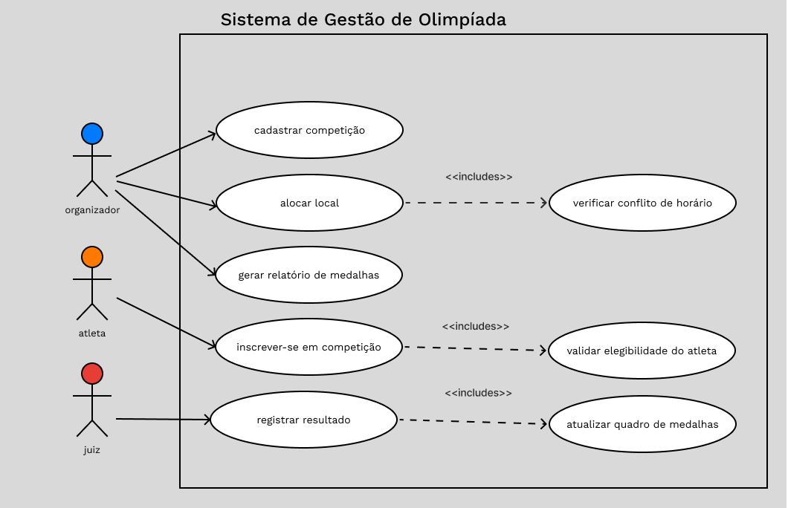
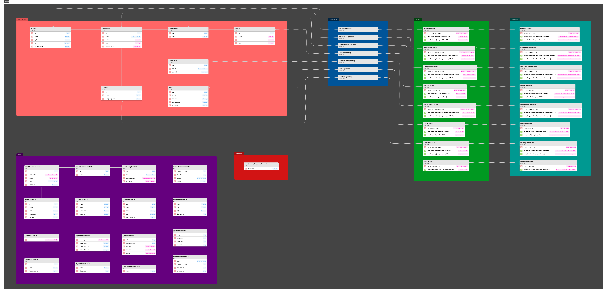
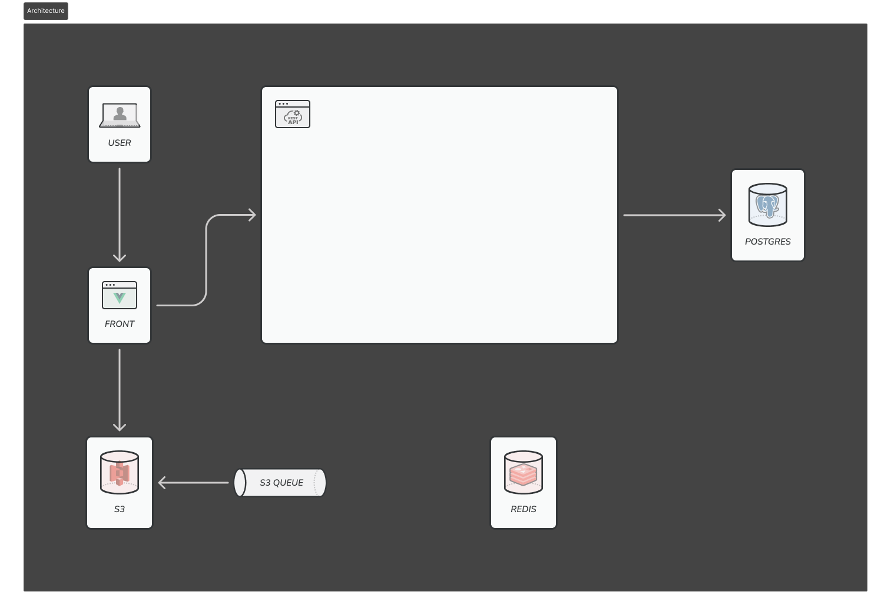
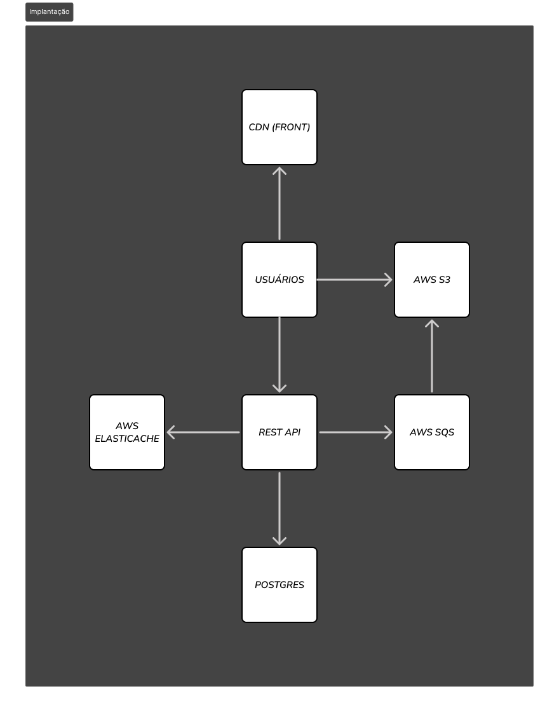

# Sistema de Gestão de Olimpíadas (SGO)

**Autores:**
* João Pedro Peres Barbosa
* Marcela Mendes Campos

## 1. Descrição do Projeto

Este projeto consiste na modelagem de um **Sistema de Gestão de Olimpíadas (SGO)**, desenvolvido como requisito para a disciplina de **Projeto de Software**.  
O SGO é uma plataforma robusta projetada para coordenar todos os aspectos de um evento olímpico, desde o planejamento inicial até a divulgação dos resultados finais.

O sistema permite o gerenciamento completo de competições, inscrições de atletas de diversas nacionalidades, alocação inteligente de locais para evitar conflitos e o registro preciso de resultados para a geração do quadro de medalhas.

---

## 2. Histórias de Usuário (User Stories)

As funcionalidades do sistema foram definidas com base nas seguintes histórias de usuário:

### US01 - Cadastro de Competição
**Como um:** Organizador do evento  
**Eu quero:** Cadastrar novas competições no sistema, especificando a modalidade, data, horário e local  
**Para que:** As competições estejam disponíveis para a inscrição dos atletas.

### US02 - Inscrição em Competição
**Como um:** Atleta  
**Eu quero:** Inscrever-me em uma ou mais competições disponíveis no sistema  
**Para que:** Eu possa participar oficialmente do evento representando meu país.

### US03 - Alocação de Locais
**Como um:** Organizador do evento  
**Eu quero:** Alocar locais para cada competição  
**Para que:** A organização evite conflitos de horário e garanta que um local não seja usado por duas competições ao mesmo tempo.

### US04 - Registro de Resultados
**Como um:** Juiz da competição  
**Eu quero:** Registrar os resultados finais de uma competição após sua realização  
**Para que:** O sistema possa determinar os vencedores (1º, 2º e 3º lugar) e atualizar o quadro de medalhas.

### US05 - Geração de Relatório de Medalhas
**Como um:** Organizador do evento  
**Eu quero:** Gerar um relatório completo do quadro de medalhas  
**Para que:** Eu possa visualizar o desempenho de cada país com base no número de medalhas de ouro, prata e bronze conquistadas.

---

## 3. Diagramas UML do Sistema

A seguir, são apresentados os **diagramas UML** que modelam a arquitetura e o comportamento do SGO.

### 3.1. Diagrama de Caso de Uso (Use Case)

O diagrama de caso de uso descreve as principais interações entre os atores (**Organizador**, **Atleta**, **Juiz**) e o sistema, detalhando as funcionalidades principais.

> **Atenção:** Substitua a URL abaixo pela imagem correspondente no seu repositório GitHub.

---

### 3.2. Diagrama de Classes e Pacotes

Este diagrama modela a estrutura estática do sistema, incluindo as principais classes (`Competicao`, `Atleta`, `Local`, `Pais`, `Resultado`) e seus relacionamentos.  
Os pacotes organizam as classes por responsabilidade, como **core**, **gestao** e **relatorios**.

> **Atenção:** Substitua a URL abaixo pela imagem correspondente no seu repositório GitHub.

---

### 3.3. Diagrama de Componentes

O diagrama de componentes ilustra a organização lógica do sistema, mostrando os principais módulos de software (**Interface de Usuário**, **Módulo de Inscrições**, **Módulo de Alocação**, etc.) e as dependências entre eles.

> **Atenção:** Substitua a URL abaixo pela imagem correspondente no seu repositório GitHub.

---

### 3.4. Diagrama de Implantação (Deployment)

Este diagrama descreve a arquitetura física do sistema, mostrando como os componentes de software são distribuídos no hardware — incluindo **servidores de aplicação**, **servidores de banco de dados** e **dispositivos dos clientes**.

> **Atenção:** Substitua a URL abaixo pela imagem correspondente no seu repositório GitHub.

---
